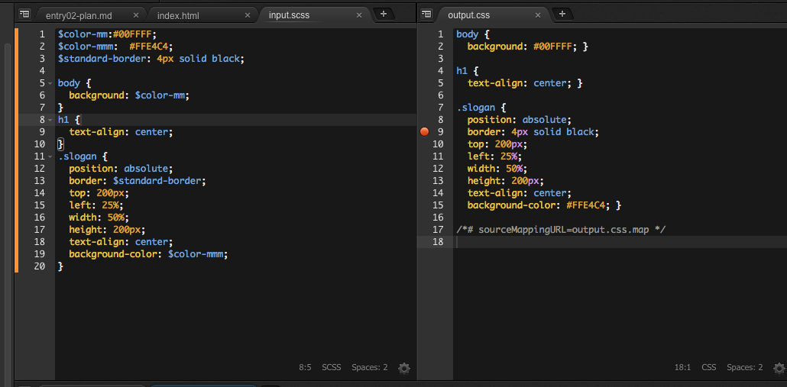
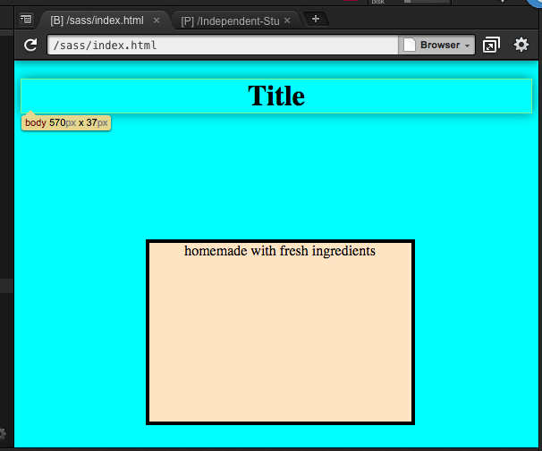

# Entry 2: Trying SASS
## How to install SASS
In order to install SASS into your workspace terminal check that you are in the right 
workspace and then in the terminal type `gem install sass`. 
An then type `sass -v`, it should return `Sass 3.4.23 (Selective Steve)`, if
it does not return that then SASS is not installed in your workspace terminal.
In case `gem install sass` does not work at all, then try `sudo gem install sass`.

Next, you sould open a filed by typing in the terminal `touch input.scss` where a file would be created

After, add some sass code in `input.scss`, then in the terminal type `sass input.scss output.css`.

Once you did that, you should see a file name `output.css` where all of your changes from your SASS file would be.

Note: SCSS is another name for a SASS file



## Things that can be done on SASS
Unlike CSS, with SASS you can use variables. Those variables save certain elements properties
that can be use through many elements in differents parts of the code. To make a variable you add a dollar sign  `$` 
in front of the variable name.

For example:
``$color-mm:#00FFFF``

Another thing that can be done on scss is the following:
```
.parent {
  font : {
    family: Roboto, sans-serif;
    size: 12px;
    decoration: none;
  }
}
```
As a result for css is:
```
.parent {
  font-family: Roboto, sans-serif;
  font-size: 12px;
  font-decoration: none;
}
```

## Takeaways
1. DONT GIVE UP AND PLAY AROUND WITH IT .
2. 


