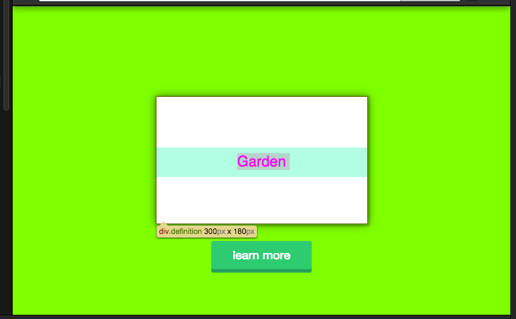
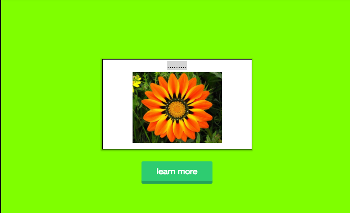
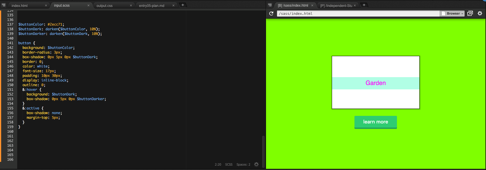

# Tinkering
### The beginning of my final project 
Well right now i'm in a process where im so confuse on what to do as my final project. Many 
thought that came to mind, where about whether to do front and back project or just a web design where sass is going be use.
Both of those ideas are going have to do with flowers and their info. In my opinion i think that a nice and relaxing way to end the school year after putting a lot of effort in our classes.

My point of doing about flowers is that everyone like them no matter if it's a girl or boy. 
Also because it would be fun to learn facts about them like what flowers are for each month and stuff like that.

As i was researching for ideas on what cool stuff it can be done with sass, i came to a web page where it gave me great tips. I began to gather examples of things done with sass and pay around with them so that i could later use them in my project.

After playing around with them and not really understanding their job and what that code does I decided to go back to css to get a review so that I could get a better understanding of the code.

At the end of the day I did understand, although i'm going to keep reviewing it.

What I came up with is the following where it's just a start of my project:

# Takeaways
####  Syntax is the most important part of coding with sass
That because one little misspelling word could make the entire code no to work properly. Like for example I was 
adding a new variables in my `input.scss` file and in the code I misspelling and i got an error that broke my entire code but the good thing from using sass is that in the terminal came up saying their is a error on line number. Meaning that with sass it tells you exactly where the error is making coding more easier and faster to find an error. 
